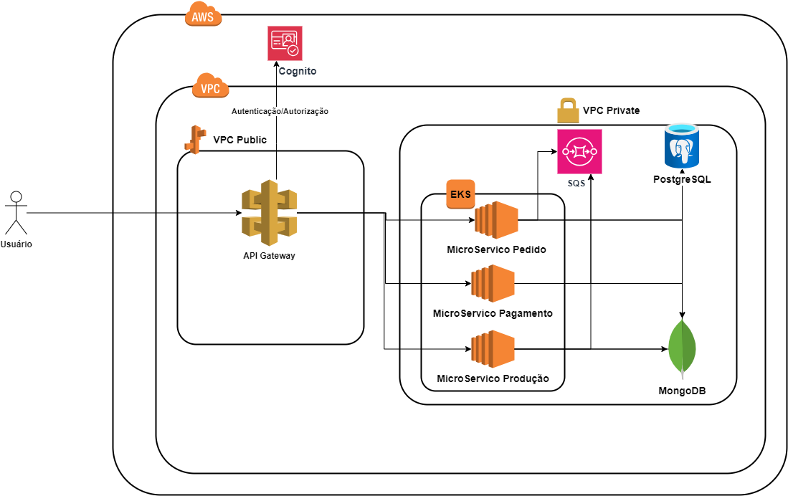

<h1 align="center">Tech Challenge - Turma 4SOAT - Grupo 68</h1>

Há uma lanchonete de bairro que está expandindo devido seu grande sucesso. Porém, com a expansão e sem um sistema de controle de pedidos, o atendimento aos clientes pode ser caótico e confuso. Por exemplo, imagine que um cliente faça um pedido complexo, como um hambúrguer personalizado com ingredientes específicos, acompanhado de batatas fritas e uma bebida. O atendente pode anotar o pedido em um papel e entregá-lo à cozinha, mas não há garantia de que o pedido será preparado corretamente. 
Sem um sistema de controle de pedidos, pode haver confusão entre os atendentes e a cozinha, resultando em atrasos na preparação e entrega dos pedidos. Os pedidos podem ser perdidos, mal interpretados ou esquecidos, levando à insatisfação dos clientes e a perda de negócios. 
Em resumo, um sistema de controle de pedidos é essencial para garantir que a lanchonete possa atender os clientes de maneira eficiente, gerenciando seus pedidos e estoques de forma adequada. Sem ele, expandir a lanchonete pode acabar não dando certo, resultando em clientes insatisfeitos e impactando os negócios de forma negativa. 
Para solucionar o problema, a lanchonete irá investir em um sistema de autoatendimento de fast food, que é composto por uma série de dispositivos e interfaces que permitem aos clientes selecionar e fazer pedidos sem precisar interagir com um atendente.  
Este projeto é um dos módulos que compõe esta solução.

##### 1. Informações do projeto:

1. **Módulo:** Backend.
1. **Arquitetura:** Microserviço com API Gateway.
1. **Padrões de Codificação:** Hexagonal.
1. **Padrão SAGA:** Coreografada.
2. **Linguagem:** Java versão 17.
1. **Banco de Dados:** PostgreSQL e MongoDB.
1. **Container:** Docker.
1. **Orquestrador de Container:** Kubernetes.
1. **Serviço de infraestrutura Cloud:** AWS Amazon.
##### 2. Desenho Arquitetural.

###### 2.1. Requisitos de negócio (problema).

Para esta solução usamos o padrão SAGA Coreografada, pois o projeto é de pequeno porte e não temos muita complexidade negocial, portanto este padrão será o mais adequado dado a sua simplicidade de implantação e compreensão. Também ajustamos todos os metodos para atender as propriedades de ACID e fazer contramedidas caso as transações venham a falhar.

###### 2.1.1. Arquitetura de Microserviços.
Conforme informado anteriormente[1], o padrão arquitetural definido para esse projeto foi a de microserviços. A arquitetura de microsserviços (geralmente chamada de microsserviços) refere-se a um estilo de arquitetura para o desenvolvimento de aplicativos. Os microsserviços permitem que um aplicativo grande seja separado em partes independentes menores, com cada parte tendo sua própria responsabilidade. Para atender a uma única solicitação do usuário, um aplicativo baseado em microsserviços pode chamar muitos microsserviços internos para compor a resposta.

Para esse módulo, aplicamos esse conceito da seguinte forma:

##### 3. Configuração e Execução:

1. Rode/Suba a pipeline da infraestrutura de [banco de dados](https://github.com/gleniomontovani/tech-challenge-pos-tech-postgres-terraform/actions/workflows/deploy_infraestrutura.yml).
1. Depois suba a infraestrutura de serviços da AWS como: [EKS, EC2, Cognito e VPC](https://github.com/gleniomontovani/tech-challenge-pos-tech-infraestrutura-terraform/actions/workflows/create_infra_api.yml).
1. Agora rode a pipeline da [API Gateway](https://github.com/gleniomontovani/tech-challenge-api-gateway/actions/workflows/deploy_aplication.yml)
1. Após isso, rode/suba os microserviços:  
   4.1 - Primeiro rode o microserviço de [Pedidos](https://github.com/gleniomontovani/POSTECH_SOAT_T4_GP68/actions/workflows/pedido.yml)  
   4.2 - Depois rode o microserviço  de [Pagamento](https://github.com/gleniomontovani/POSTECH_SOAT_T4_GP68/actions/workflows/pagamento.yml)  
   4.3 - Posteriormente, rode o microserviço de [Produção](https://github.com/gleniomontovani/POSTECH_SOAT_T4_GP68/actions/workflows/producao.yml)  

As infraestrutura de banco de dados e de serviços AWS estão com as pipeline configuradas para rodarem de forma manual. Já as pipeline dos microserviços e da API Gateway rodaram com um Pull Request para a branch main.

##### 4. Segurança:
Para esse sistema foi usado o OWASP Zap para verificação de segurança, no qual foi executado o mesmo na API Gateway e verificada e existencia de alguma vunerabilidade foi feita a correção das mesma.

Segue abaixo os link:

1 - [Original](https://gleniomontovani.github.io/tech-challenge-api-gateway/original.html)  
2 - [Corrigido](https://gleniomontovani.github.io/tech-challenge-api-gateway/corrigido.html)  

##### 5. Relatório de Impacto dos Dados:

Para este projeto foi feito uma análise de impacto dos dados pessoais (RIPD) no sistemas. Essa análise resultou no seguinte [relatório](https://github.com/gleniomontovani/POSTECH_SOAT_T4_GP68/blob/main/RIPD.pdf).

---
##### 6. As APIs disponíveis são: &nbsp;

1. Cliente:   
   1.1. Criação;    
   1.2. Edição;
1. Produto:   
   2.1. Criação;   
   2.2. Edição;  
   2.3. Remoção;   
   2.4. Busca por número;   
   2.5. Busca por Categoria.
1. Pedidos:  
   3.1. Criaação(Com e sem identificação do cliente);  
   3.2. Consultar;  
   3.3. Alterar Status.
1. Pagamentos:   
   4.1. Consultar por Pedido;  
   4.2. Histórico de tentativas de pagamento (Webhook).

&nbsp;
---

> * Para utilizar as APIs, baixe o arquivo [JSON](https://github.com/gleniomontovani/tech-challenge-api-gateway/blob/main/Tech-challenge.postman_collection.json), faça a importação no Postaman e altere a URL para a que foi gerada no Loand Balancer da AWS.

> * Segue o link do vídeo demonstrando a arquitetura desenvolvida [aqui](https://youtu.be/9nAS2MkmzEM).
